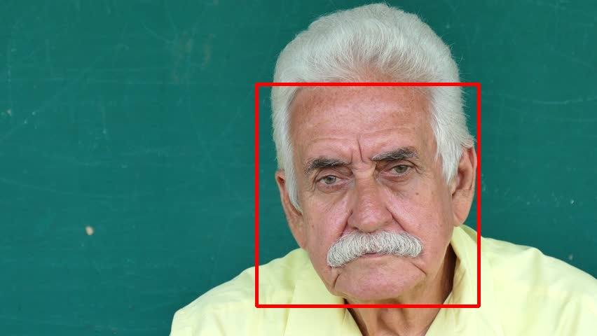
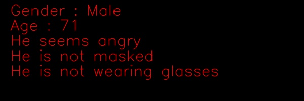
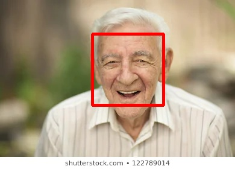
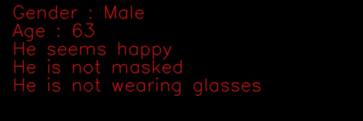
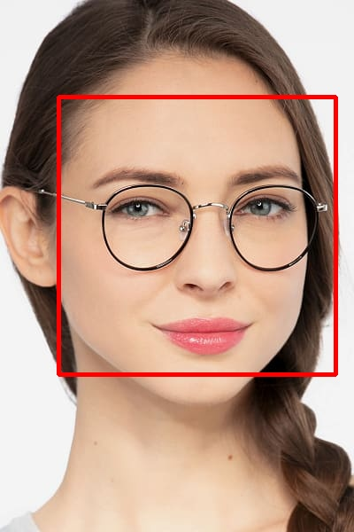
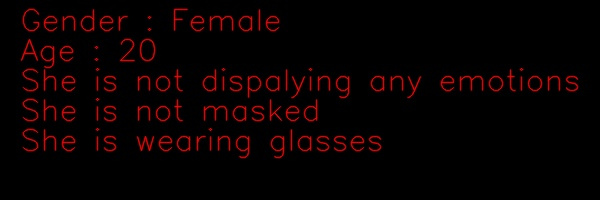

# ARGUS (Assistant Robot Granting Useful Services)
This repo will focus the Computer Vision modules that give ARGUS the ability to recognize people analysing their emotions and physical appearance (gender, age and if individual is masked or wearing glasses...).  
  
## Facial Analysis 
This will be used in case the person in the frame is not recogized. ARGUS will provide a description of the person
Input image            |  Output
:-------------------------:|:-------------------------:
  |  
|
|
